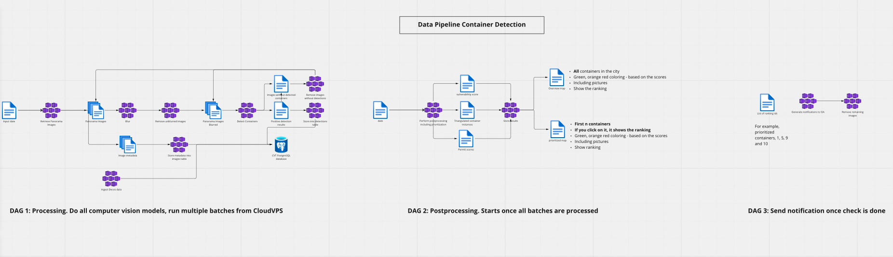
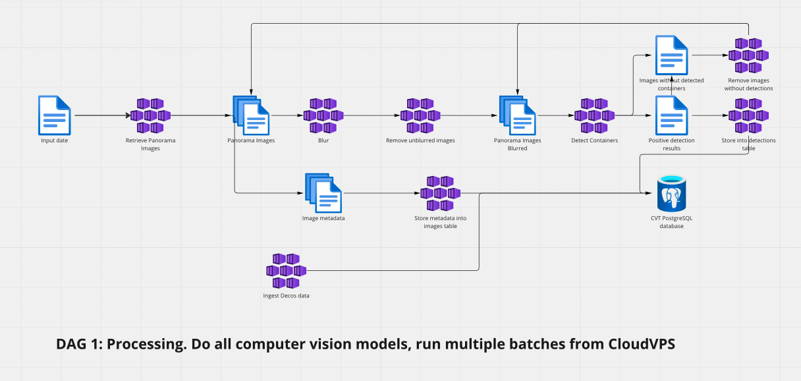
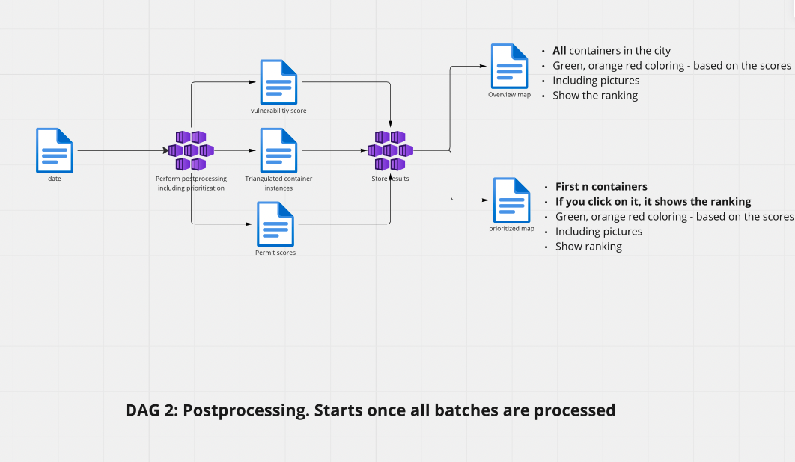
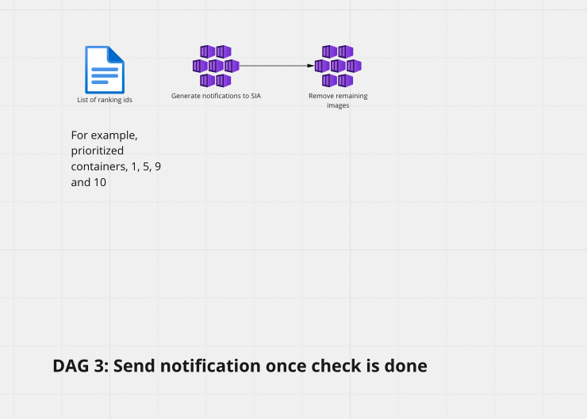
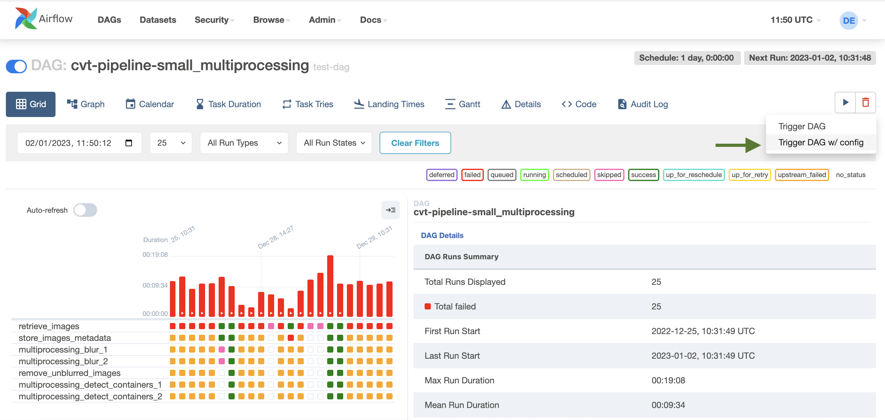
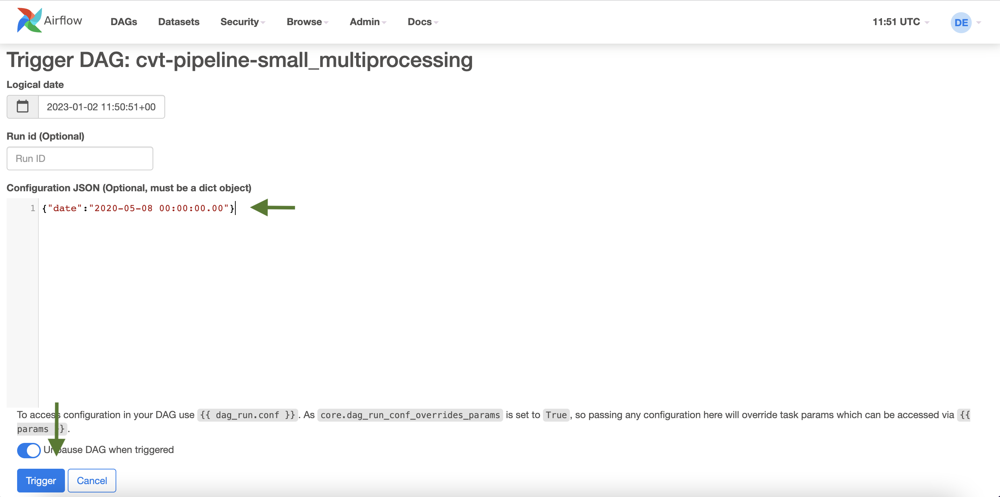
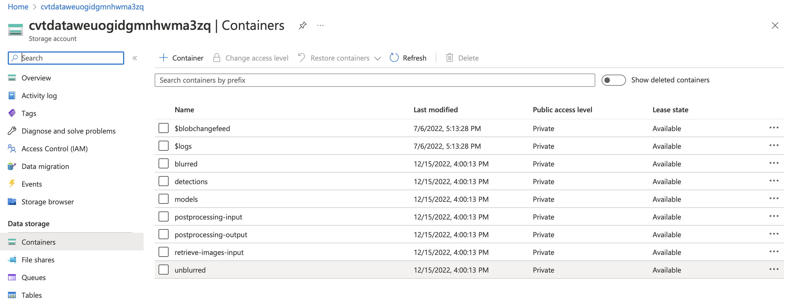

# Airflow-computervision
This is the airflow repository of the computer vision team.
This repository contains the pipelines that are used in our container project.

We created the pipelines in this repository based on the below image in the [CVT Drafts Miro board](https://miro.com/app/board/uXjVOVQfTW4=/?share_link_id=412250854483).

## Structure

As you can see in the image below our pipeline is split in three main parts.

1. DAG 1. Processing.

This DAG is responsible for retrieving images from cloud, storing them in our storage account from Azure 
and running 2 AI models, the blurring model and the container detection model. 
It also contains tasks to remove the images from the storage account once they're processed. 
This first DAG is going to be run multiple times in order to optimise the large amount of data that must be processed.

2. DAG 2. Postprocessing.

This DAG contains only one task end is responsible for combining the predictions of the container model with 
two other sources namely the permit data from Decos and the locations of vulnerable bridges. 
This pipeline also creates the maps in HTML format which summarise the current situation of where illegal containers 
are present in the city centre.

3. DAG 3. Submit notifications.

This DAG is responsible for sending a signal to see you based on the content of the maps produced by DAG 2. 

## How to trigger a DAG.

Each DAG is triggered manually from airflow. When we trigger one pipeline we trigger it with a configuration.

In the configuration JSON, fill in the date argument in the `%Y-%m-%d %H:%M:%S.%f` format, as shown below.

Lastly, press the `Trigger` button.

## Where we store results
While the DAGs are running, the data (images, json files, csv files) are being created in different containers
in the storage ccount. Below is an overview of the containers in `development` storage account.

The purpose of the containers is as follows:
- `retrieve-images-input`: We run the pipeline on day X. Thus, we need to download all images from CloudVPS from day X.
This container has a list of files with panorama ids that should be downloaded. There are multiple files because we split
the workload among multiple workers, given the large amount images to download. (~10k per day)
- `unblurred`: This is where we store the downloaded images. These are "badly" blurred images from the 
datapunt objectstore.
- `blurred`: This is where we store the blurred images after the `Blur` task from DAG 1.

**NOTE:** After this task successfully finishes, the corresponding "badly" blurred images from the `unblurred` container
are removed.
- `detections`: This is where we store the output of the `Detect Containers` task from DAG 1. The output is a 
`coco_instances_results_*.json` file with ids of images that have containers and a `empty_predictions.json` file
with ids of images that do not have containers.

**NOTE:** After this task successfully finishes, based on the `empty_predictions.json` file, the corresponding images 
from the `blurred` container are removed.
- `postprocessing-input`: This is where we store the input of DAG 2, namely the `coco_instances_results_combined.json`
file, the daily Decos dump and the general `vulnerable_bridges.geojson` file.
- `post-processing-output`: This is where we store the output of DAG 2, namely the `Overview.html` and
`Prioritized.html` maps, the `prioritized_objects.csv` (both maps are created based on this file) and the 
`permit_locations_failed.csv` file.

## Workflow

